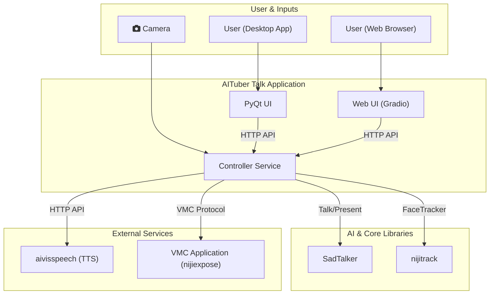

# aituber-talk

aituber-talkは、**テキストを入力するとAIアバターがその内容を発話し、顔の動きやリップシンクを伴うモーションをVMCプロトコルで送信する**AIアバター生成パイプラインです。


本プロジェクトは
- [aivisspeech](https://github.com/seagetch/aivisspeech)（テキスト→音声合成/TTS）
- [SadTalker](https://github.com/OpenTalker/SadTalker)（音声＋画像→顔アニメーション生成）
- [nijiexpose](https://github.com/nijigenerate/nijiexpose). (アバター表示プログラム）
を統合し、テキスト入力から音声合成、リップシンク、表情生成までを一貫して自動化します。

生成されたモーションはVMCプロトコルで外部のVRMアバターなどにリアルタイムで送信できます。

**用途例:**
- テキスト原稿から自動でAIアバターによるプレゼン動画を作成
- デスクトップアプリやWeb UIでテキストを入力し、即座にアバターを動かす
- API経由で自動動画生成パイプラインを構築

---

## 主な特徴

- **統合アプリケーション:** `app.py`を実行するだけで、バックエンドとUIが一体となって起動します。
- **選べるUI:** 用途に応じて2種類のUIを選択できます。
  - **PyQtデスクトップアプリ (デフォルト):** ローカルでの利用に最適化された、応答性の高いUI。
  - **Gradio Web UI:** ブラウザ経由で手軽にアクセスできるUI。
- **リアルタイムモーション送信:** 生成された顔のモーションをVMCプロトコルで送信し、VRMアバターなどをリアルタイムに動かせます。
- **高品質なAIモデル:** aivisspeechによる高品質な音声合成と、SadTalkerによる高精度な顔アニメーション生成を統合。
- **プレゼンテーションモード:** PowerPointと連携し、スライドのノートを自動で読み上げてプレゼンテーションを自動進行させる機能を搭載。
- **FaceTrackerモード:** Webカメラを使用し、リアルタイムで顔の動きをキャプチャーしてアバターに反映させる機能を搭載。

---

## システムアーキテクチャ

`app.py`が単一のエントリポイントとなり、バックエンドとなる「コントローラーサービス」と、操作用の「UI」を起動します。コントローラーは、テキスト読み上げ（Talk）、プレゼンテーション（Present）、顔追跡（FaceTracker）といった各モードに応じて、`SadTalker`、`nijitrack`などのAIライブラリを協調させてモーションを生成し、VMCプロトコルで送信します。



---

## インストール

環境構築用のスクリプトが用意されています。お使いの環境に合わせて実行してください。

### 1. Python環境の構築

プロジェクトに必要なライブラリを含むPython仮想環境を構築します。

**Windows (PowerShell):**
```powershell
.\scripts\setup_env.ps1
```

**Linux/macOS (Bash):**
```bash
bash ./scripts/setup_env.sh
```

スクリプトが完了すると、プロジェクトルートに`.venv`という名前の仮想環境が作成されます。

### 2. SadTalkerモデルのダウンロード

顔アニメーション生成に必要な学習済みモデルをダウンロードします。

**Windows (PowerShell):**
```powershell
.\scripts\setup_sadtalker.ps1
```

**Linux/macOS (Bash):**
```bash
bash ./scripts/setup_sadtalker.sh
```

### 3. FaceTracker(nijitrack)のセットアップ

FaceTrackerモードを使用するために、`nijitrack`ライブラリをインストールします。

**Windows (PowerShell):**
```powershell
.\scripts\setup_nijitrack.ps1
```

**Linux/macOS (Bash):**
```bash
bash ./scripts/setup_nijitrack.sh
```

### 4. (任意) aivisspeechのセットアップ

高品質な日本語音声合成を利用するには、別途[aivisspeech](https://github.com/seagetch/aivisspeech)のセットアップが必要です。

- **Windows/macOS (推奨):**
  [リリースページ](https://github.com/seagetch/aivisspeech/releases)から最新版のアプリケーションをダウンロード・インストールして起動してください。

- **Linux:**
  Dockerコンテナを起動するのが簡単です。`aivisspeech`リポジトリの手順に従ってください。


---

## 使い方

`app.py`を実行することで、バックエンドのコントローラーサービスとUIが同時に起動します。

### PyQtデスクトップUI (デフォルト)

コマンドプロンプトやターミナルで以下を実行します。

```bash
python app.py
```

応答性の高いデスクトップアプリケーションが起動します。

### Gradio Web UI

Webブラウザで利用したい場合は、`--ui web`オプションを付けて実行します。

```bash
python app.py --ui web
```

起動後、ターミナルに表示されるURL (`http://127.0.0.1:8000`など) にブラウザでアクセスしてください。

### 各モードの使い方

UIには複数のモードがタブとして表示されます。同時に有効にできるモードは1つだけで、新しいモードを開始すると他のモードは自動的に停止します。

#### Talkモード

アバターに任意のテキストを話させることができます。

1. 「Talk」タブを開きます。
2. 話させたいテキストを入力します。
3. 「Send Talk Request」ボタンを押すと、音声が生成され、アバターが発話モーションを開始します。

#### Presentモード

PowerPointファイルと台本（テキストまたはMarkdownファイル）を使って、プレゼンテーションを自動進行させることができます。

1. 「Present」タブを開きます。
2. 「Upload Script」と「Upload PowerPoint」から、それぞれ台本ファイルとPowerPointファイルをアップロードします。
3. 「Start Presentation」ボタンを押すと、スライドショーが開始され、台本に従ってアバターがスライドを読み上げます。

#### FaceTrackerモード

Webカメラを使って、リアルタイムであなたの顔の動きをアバターに反映させます。

1. 「FaceTracker」タブを開きます。
2. 使用するカメラの番号や、VMCを送信したいアプリケーションのホスト・ポートを設定します。
3. 「Start Tracking」ボタンを押すと、Webカメラが起動し、顔の動きの送信が開始されます。
4. 「Stop Tracking」ボタンで追跡を停止します。

### 主なコマンドライン引数

- `--ui [pyqt|web]`: 起動するUIを選択します (デフォルト: `pyqt`)。
- `--device [auto|cpu|cuda]`: AIモデルを実行するデバイスを選択します (デフォルト: `auto`)。
- `--list-devices`: 利用可能なデバイスの一覧を表示して終了します。
- `--open-browser`: Web UI利用時に、起動と同時にブラウザを自動で開きます。

---

## ディレクトリ構成

- `app.py`: **統合アプリケーションランチャー (メインの実行ファイル)**
- `requirements.txt`: 依存パッケージリスト
- `ui/`: UI関連のコード
  - `pyqt/app.py`: PyQtデスクトップアプリケーションの実装
  - `web/app.py`: Gradio Web UIの実装
- `controller/`: バックエンドのコントローラーサービス関連のコード
- `core/`: `TalkEngine`など、中核となるAI処理パイプライン
- `plugins/`: `Talk`, `Present`, `FaceTracker`などの各モードの実装
- `SadTalker/`: SadTalker本体および関連ファイル
- `scripts/`: `setup_env`, `setup_sadtalker`, `setup_nijitrack`などのセットアップ用スクリプト

## ライセンス

本プロジェクトはSadTalkerのライセンス（[SadTalker/LICENSE](SadTalker/LICENSE)）に準拠します。詳細は各サブディレクトリのLICENSEファイルを参照してください。
