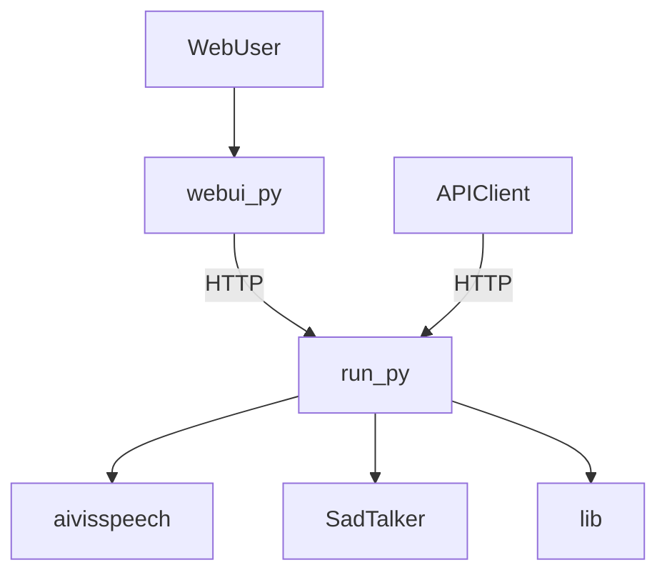

# aituber-talk

aituber-talkは、**テキストを入力するとAIアバターがその内容を発話し、顔の動きやリップシンクを伴う動画を自動生成できる**AIアバター生成パイプラインです。

本プロジェクトは  
- [aivisspeech](https://github.com/seagetch/aivisspeech)（テキスト→音声合成/TTS）
- [SadTalker](https://github.com/OpenTalker/SadTalker)（音声＋画像→顔アニメーション生成）  
を統合し、テキストから音声合成・リップシンク・表情生成までを一貫して自動化します。

**用途例:**  
- テキスト原稿から自動でAIアバターによるプレゼン動画を作成
- Web UIでテキストを入力し、即座に喋るアバター動画を生成・確認
- API経由で自動動画生成パイプラインを構築

---

## システム概要・利用シナリオ

本プロジェクトは「run.py」をAIアバター生成の**バックエンドAPIサーバー**として動作させ、  
- **テキスト→音声合成（aivisspeech）**
- **音声＋画像→顔アニメーション生成（SadTalker）**
という2段階のAI処理を統合し、  
- **webui.py（GradioベースWeb UI）で直感的にテキスト入力→アバター動画生成**
- **外部クライアント/スクリプトからAPI経由で一連の処理を自動化**
が可能です。

> **重要:**  
> run.pyはHTTPリクエストを受け付けるAPIサーバープロセスであり、  
> テキスト→音声合成（aivisspeech）→顔アニメーション生成（SadTalker）を統合的に実行します。  
> webui.pyはrun.pyのAPIサーバーが起動していることを前提に、HTTP経由でAI処理を依頼します。

### 代表的な利用シーン

- **テキストから自動で喋るアバター動画を生成**  
  Web UIやAPI経由でテキストを入力→音声合成→リップシンク動画生成まで一括
- **APIサーバーとしての利用**  
  run.pyを起動し、外部クライアントや自作スクリプトからHTTPリクエストでAIアバター生成APIを利用
- **Web UIによるインタラクティブ操作**  
  webui.pyを起動し、ブラウザからテキスト入力や画像・音声アップロードで即座にAIアバター動画を生成

---

## アーキテクチャ（Mermaid形式）



---

## 特徴

- テキスト入力からAIアバターの発話・リップシンク動画を自動生成
- aivisspeechによる高品質な音声合成（TTS）
- SadTalkerによる高精度な顔アニメーション・リップシンク
- 独自の拡張機能やユーティリティ（`lib/`, `run.py`, `webui.py` など）
- Web UI/REST API両対応
- セットアップ用シェルスクリプトを同梱
- サンプル画像・音声・動画付き

## セットアップ

本プロジェクトはconda環境での動作を推奨します。  
**run.py用**と**webui.py用**でセットアップ手順・環境が異なります。

---

### 【run.py用セットアップ】

1. SadTalkerおよび依存パッケージのインストール

   ```bash
   bash 01_install_sadtalker.sh
   ```

   - SadTalkerのクローン、conda環境（python=3.11, 環境名: sadtalker）の作成・有効化、依存パッケージのインストールを自動で行います。
   - 依存パッケージは`requirements-sadtalker.txt`に記載されています。

2. モデルや追加環境のセットアップ（必要に応じて）

   ```bash
   bash 00_aivisspeech_docker.sh
   bash 02_install_sadtalker_model.sh
   ```

   ※詳細は各シェルスクリプト内のコメントを参照してください。

3. 環境の有効化

   ```bash
   conda activate sadtalker
   ```

---

### 【webui.py用セットアップ】

1. Web UI用conda環境の作成

   ```bash
   bash 03_install_webui.sh
   ```

   - `environment-webui.yml`を用いて`aituber-talker-webui`環境を作成します。
   - gradio, requests等の必要最小限の依存パッケージがインストールされます。

2. 環境の有効化

   ```bash
   conda activate aituber-talker-webui
   ```

---

> **注意**  
> `requirements.txt`は存在しません。依存パッケージは`requirements-sadtalker.txt`または`environment-webui.yml`をご利用ください。

## 使い方

### 1. バックエンドAPIサーバー（run.py）の起動

1. `sadtalker`環境を有効化

   ```bash
   conda activate sadtalker
   ```

2. APIサーバーとしてrun.pyを起動

   ```bash
   python run.py
   ```

   - デフォルトで指定ポート（例: 5000等）でHTTPサーバーが立ち上がります。
   - ポート番号や詳細はrun.pyの実装・引数を参照してください。

---

### 2. Web UI（webui.py）の起動

1. `aituber-talker-webui`環境を有効化

   ```bash
   conda activate aituber-talker-webui
   ```

2. Web UIを起動

   ```bash
   python webui.py
   ```

   - 起動時にバックエンドAPIサーバー（run.py）が起動済みである必要があります。
   - ブラウザで `http://localhost:7860` などにアクセスしてください（ポート番号はwebui.pyの設定に依存）。

---

### 3. 外部クライアント/スクリプトからAPI利用

- run.pyのAPIエンドポイントに対してHTTPリクエストを送信することで、プログラムからAI顔アニメーション生成を自動化できます。
- API仕様・エンドポイントはrun.pyの実装を参照してください。


## ディレクトリ構成

- `run.py` : バックエンドAPIサーバースクリプト
- `webui.py` : GradioベースWeb UI（run.pyのAPIを利用）
- `lib/` : 独自拡張・ユーティリティ
- `SadTalker/` : SadTalker本体および関連ファイル
- `aivisspeech-test/`, `sadtalker-test/` : テスト・サンプル用スクリプト
- `requirements-sadtalker.txt` : run.py用依存パッケージ一覧
- `environment-webui.yml` : webui.py用conda環境定義ファイル
- `*.sh` : セットアップ用シェルスクリプト

## 参考

- [SadTalker公式リポジトリ](https://github.com/OpenTalker/SadTalker)
- [SadTalkerドキュメント](SadTalker/README.md)
- 依存パッケージ例（requirements-sadtalker.txtより抜粋）:
    - face_alignment
    - imageio, imageio-ffmpeg
    - librosa, numba, resampy, pydub, scipy
    - kornia, tqdm, yacs, pyyaml, joblib
    - scikit-image, basicsr, facexlib, gradio, gfpgan, av, safetensors
- webui用環境（environment-webui.yml例）:
    ```yaml
    name: aituber-talker-webui
    channels:
      - conda-forge
    dependencies:
      - python=3.11
      - pip
      - pip:
        - gradio
        - requests
    ```

## ライセンス

本プロジェクトはSadTalkerのライセンス（[SadTalker/LICENSE](SadTalker/LICENSE)）に準拠します。詳細は各サブディレクトリのLICENSEファイルを参照してください。
